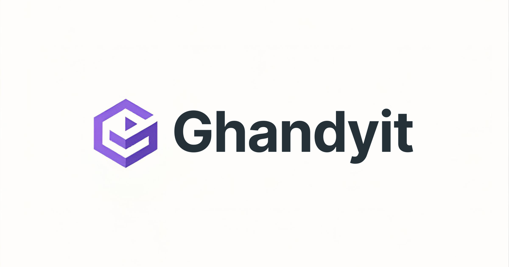

  

<h1 align="center">Ghandy</h1>

  <strong>Systems builder across infrastructure, backend, automation, applied AI, data, and security</strong> 
  Making complex work understandable, repeatable, and easier to operate.

  <a href="https://ghandyp.github.io/"><strong>Explore the portfolio ↗</strong></a>
  &nbsp; · &nbsp;
  <a href="https://github.com/GhandyP">GitHub</a>
  &nbsp; · &nbsp;
  <a href="https://linkedin.com/in/martin-prieto-564253a9">LinkedIn</a>

---

> **Ideas do not survive without infrastructure. Infrastructure makes ideas survive.**

I work at the boundary between technical systems and the problems they serve: diagnosing constraints, designing clear boundaries, automating repeatable work, and making behavior easier to verify. My profile spans cloud and hybrid infrastructure, backend services, DevOps/DevSecOps, business automation, retrieval and agent workflows, data analysis, and operational communication.

This README is an orientation map, not a claim that every listed technology represents equal depth or production experience. Public work is linked where available; private/client work is described only at a safe level.

## Capability and value map

| Area | Problems I help address | Typical methods and evidence boundary |
| :--- | :--- | :--- |
| **Infrastructure & delivery** | Drift, fragile environments, difficult releases, unclear operations | Linux, AWS, Terraform/Terragrunt, Docker, Kubernetes, CI/CD, reverse proxies; project-specific proof required |
| **Backend & architecture** | Ambiguous requirements, brittle integrations, state and persistence problems | Go/Python services, REST APIs, PostgreSQL/SQLite, typed contracts, modular and hexagonal boundaries, health/readiness and audit paths |
| **DevSecOps & reliability** | Risky change, weak recovery, invisible failure modes | Secrets and access controls, hardening, policy gates, backups, monitoring, logs, runbooks, validation, replay, idempotency |
| **Applied AI, agents & automation** | Manual workflows, unstructured knowledge, unsafe tool use | Client RAG and multi-agent workflows, n8n automations, MCP/tool boundaries, Google ADK experiments, local models, Neo4j graph retrieval; private or prototype work is not presented as production by default |
| **Data & decision support** | Messy information, uncertain analysis, poor operational visibility | SQL, ETL, reporting, Power BI, Pandas/NumPy, forecasting, Bayesian analysis with PyMC/Bambi, provenance/freshness/confidence controls |
| **Products & domain translation** | Technical ideas that do not reach usable workflows | ERP modernization, marketplaces, wallets and donation/impact simulations, field/construction and operational contexts, documentation and customer-facing communication |

## Selected work and contribution patterns

The broader inventory includes backend, infrastructure, analytics, product, and AI/agent work. The examples below retain their maturity boundaries:

- **Infrastructure and hybrid systems** — repeatable environments, middleware, databases, observability, and operational controls. *Evidence/maturity: repository and profile evidence varies; specific projects require current verification.*
- **Client RAG and multi-agent workflows** — retrieval, orchestration, tool boundaries, validation, and human review for client-facing use cases. *Evidence/maturity: user-confirmed work; client identities, artifacts, metrics, and production status remain private or unverified.*
- **n8n enterprise automations** — workflows across marketing, operations, sales, and finance. *Evidence/maturity: user-confirmed contribution; public workflow exports and impact metrics are not published here.*
- **Neo4j and graph-oriented retrieval** — knowledge-graph structures for personal RAG and client reports. *Evidence/maturity: user-confirmed project family; publication and implementation proof require review.*
- **Backend and reliability prototypes** — Go/SQLite applications, wallet and donation/impact simulations, deterministic analysis tools, and workflow services. *Evidence/maturity: prototype or verification-pending unless a linked artifact proves otherwise; simulations are not financial products.*
- **Data and analytics work** — operational reporting, product-analytics research, forecasting, Bayesian modeling, and data-quality patterns. *Evidence/maturity: mixed prototype/research/verification-pending; no impact metrics are claimed.*

## How I work

**Understand → Define → Build → Automate → Verify → Document**

- Start with the real constraint, not only the visible symptom.
- Make contracts, schemas, permissions, state transitions, and failure modes explicit.
- Prefer understandable, testable, observable, replaceable architecture.
- Use dry runs, allowlists, approval gates, deterministic fallbacks, provenance, replay, and idempotency where automation can create risk.
- Treat tests, health checks, runbooks, evidence, and limitations as part of delivery.
- Translate technical trade-offs into operational, financial, security, and product consequences.

<strong>Deeper technical coverage</strong>

**Languages and development:** Python, Go, TypeScript, Bash/Shell, SQL, with additional Rust exposure. FastAPI/Uvicorn, Go `net/http`, server-rendered applications, Pydantic, REST APIs, repositories, migrations, sessions, and lifecycle-oriented designs.

**Platforms and operations:** Linux (including Debian, Kali, and Ubuntu Server contexts), AWS, Terraform, Terragrunt, Docker, Kubernetes, GitHub Actions, Nginx, Apache, Tomcat, PostgreSQL, MySQL, Redis, SQLite, Prometheus, Grafana, CloudWatch, backups, and monitoring.

**AI and data ecosystem:** local LLM workflows (including Gemma, Qwen, and Mistral where project evidence exists), Hugging Face/Transformers, LangChain, LangGraph, LangFlow, RagFlow, MCP, Google ADK, n8n, Neo4j, YOLO/computer vision, ComfyUI, Pandas, NumPy, Power BI, PyMC, and Bambi. Tool presence is not treated as proof of mastery.

**Testing and evaluation:** unit, HTTP, contract, boundary, state-machine, replay, and integration-oriented tests; `pytest`/`httpx`, Go tests and vet, and other project-specific checks. Formal LLM benchmarks, LLM-as-judge calibration, and measured business impact remain evidence gaps unless linked to a verified report.

<strong>Current learning and research</strong>

Cloud architecture, Linux hardening, applied machine learning, transformer-based NLP, local models, data provenance, product analytics, graph RAG, agent/tool evaluation, and safer automation. These are learning or research tracks unless a specific public artifact establishes delivered work.

## About this repository

This repository contains the static portfolio: **HTML, CSS, and vanilla JavaScript** for GitHub Pages. The implementation details are secondary to the professional profile above.

[Portfolio page](https://ghandyp.github.io/) · [Page structure](index.html) · [Styles](style.css) · [Interactions](script.js) · [Deployment workflow](.github/workflows/deploy.yml)

  <strong>Let’s talk systems.</strong> 
  Connect on <a href="https://linkedin.com/in/martin-prieto-564253a9">LinkedIn</a> or explore public work on <a href="https://github.com/GhandyP">GitHub</a>.

